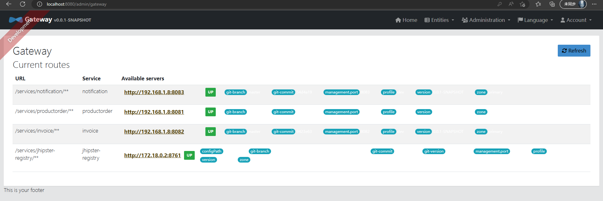
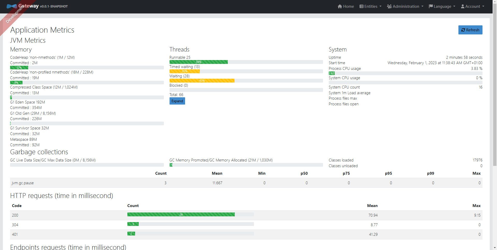
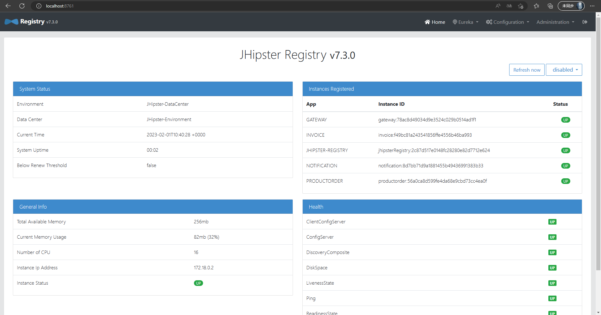
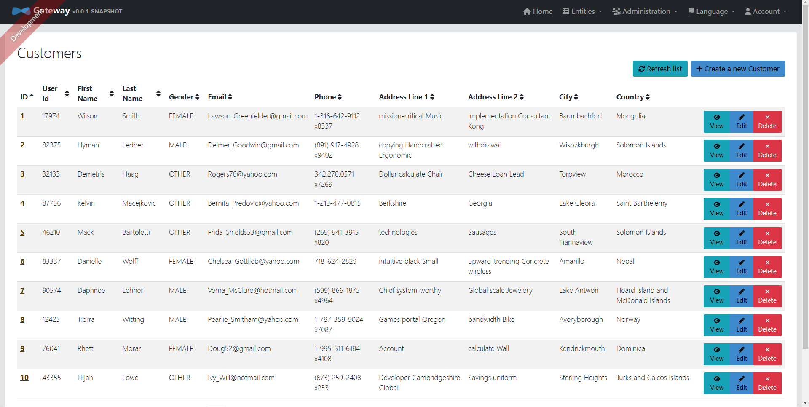

# Microservice Deployment Report
By Yucheng XIAO, githubID SaviorSeva, yucheng.xiao@etu.grenoble-alpes.fr
## Part 1. Generate the microservices architecture

### Generation of apps

    Generate the gateway, productorder, invoice, notification by jhipster.

### Browse the gateway application in localhost:8080
#### What can you see? What's happen if one microservice is stopped (failure simulation ...)?
    
    In Gateway-current routes in localhost:8080, we can see the url and server address of corresponding service. If one service stops, it will disappear from the page. We can also sees the JVM metrics, health of services, etc.




### Browse the service registry in localhost:8761
#### What can you see? What's happen if one microservice is stopped (failure simulation ...)?
    Can see system status and registered instance. The name of microservices and the instance ID is shown in the registered instance part. It also shows the current status of microservices (up or down). When a microservice is configuring, it will shown as state down. If one microservice stops, it will disappear from the page.


### Generation of frontend
    Pulling jdl.jh files from github repository, and import the files by jhipster.
After the operation, data will be presented in database.


### Build the Docker images
Problem: Windows system cannot runs the `npm run java:docker` command. Here command `./gradlew bootJar -Pprod jibDockerBuild` is used to generate corresponding image instead.

### Generation the docker-compose files
Command to scale up invoice microservice: `docker-compose up --scale invoice=2`  
After generation we can start docker composed file. Here's the docker desktop when running composed file:

Problem: After a certain amount of time, application gateway will stop working for no obvious reason.


## Part 2. Deployment of microservices on Google Cloud Platform
### Sending the images to google container registery


### Create Clusters to run microservice apps
Problem: Unable to run `bash kubectl-apply.sh`, return error:
  
  ```The connection to the server localhost:8080 was refused - did you specify the right host or port?```

Trying to run the clusters, but gateway application crashed


## Part 3. Enabling scalability on GCP for one microservice
This is achieveable by enable a setting on vertical pod auto-scaling


## Part 4. Monitoring dashboard
TODO
## Part 5. Load injection with Gatling for demonstrating scalability
TODO